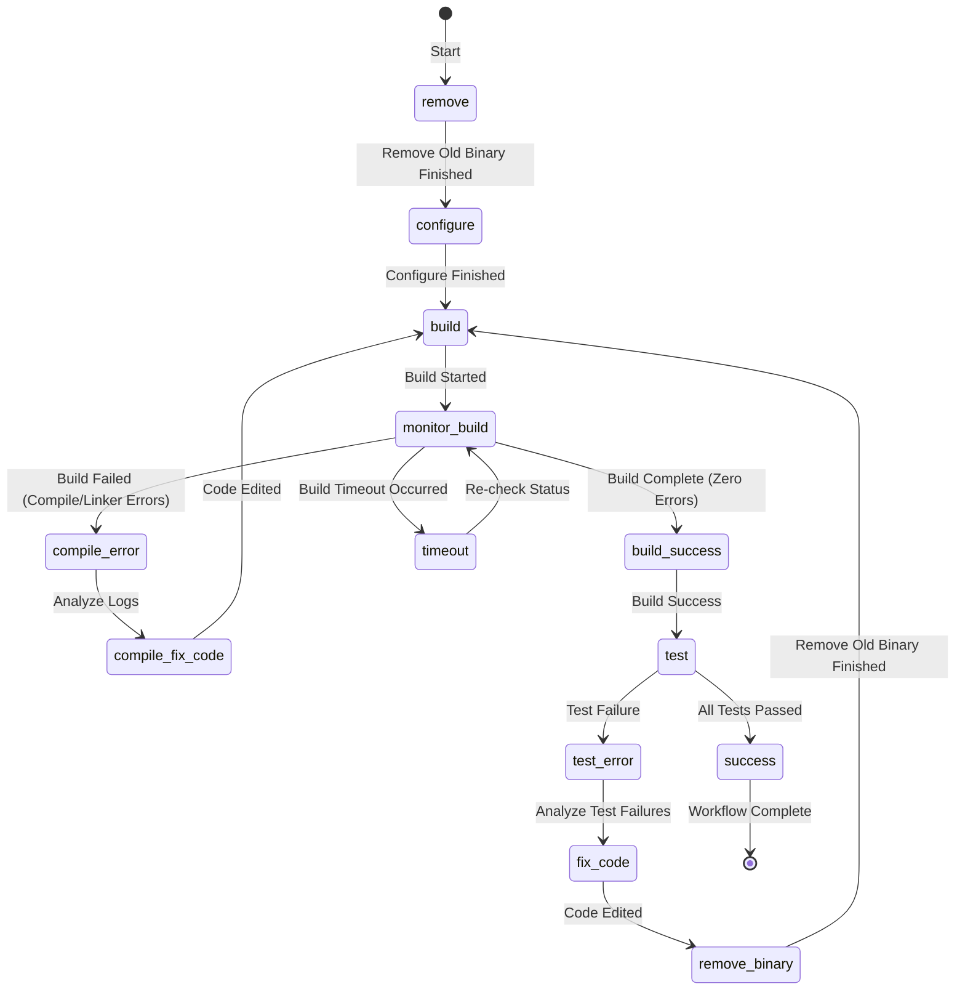

# Agent Development Workflow version 2.2

This document outlines the specific build and testing workflow for this repository. It is very important to run the commands seperately as documented.
Do not combine commands for example `command1 && command2`. Use separate run_in_bash_session tool calls for each command.

## Cleaning

Before building its a essential to remove the old application binary. This will prevent false test results

```bash
rm -vf /build/rapcad
```

## Configuring

To configure the build, run the following command:

```bash
qmake6 /app/rapcad.pro -o /build/Makefile CONFIG+=test CONFIG+=silent
```

This command configures the project with `test` support. We use `silent` to provide clean output for the incremental build workflow discussed below.

## Building

This project uses an backgroud compile strategy to avoid timeouts. There must be no jobs running when starting a build as it will comsume to many resources.
Jobs can be queried using the `jobs` command with empty output indicating no jobs.

```bash
make -C /build > /build/build.log 2>&1 &
```

When the build is running, we can monitor the logs. The build process takes a significant amount of time, potentially longer than the system's default timeout of 400 seconds.

To avoid this system timeout, we use a deliberate strategy of monitoring the build in chunks.

```bash
timeout 300 tail -f /build/build.log --pid $(jobs -p %make)
```

**IMPORTANT:** This command is **expected to time out** after 300 seconds (5 minutes). This is not an error. After it times out, you should check the end of the log file (`/build/build.log`) for a success message (e.g., "linking rapcad", "make: Nothing to be done for 'first'." ) or a compile error. When the build is complete the log might simply end with "make: Leaving directory '/build'" look for error messages in the full log.

If the log appears to simply be saying that its compiling files, you must **repeat the `timeout 300 tail -f /build/build.log --pid $(jobs -p %make)` command** to continue monitoring the build. Repeat this step until the build is confirmed as complete or has failed.

## Testing

After a successful build, you can run the test suite with the following command:

```bash
/build/rapcad -t /app/test
```

## Workflow state diagram:



## Incremental Building

After making small code changes, you can perform a much faster incremental build.

For an incremental build, you must **not** clean the entire build directory. Instead, only remove the final binary:

```bash
rm -f /build/rapcad
```

After removing the binary, follow the exact same background build and monitoring process described in the "Building" section. The process has been verified to work correctly for this scenario, and the build should complete much more quickly.

## Test Case Creation Workflow

For new features, new test cases should be added. For features that do not have a `test()` function in their `.rcad` file, the following workflow should be used to create the test baseline:

1.  **Create the `.rcad` test file.** Add the new test script to the appropriate directory under `/app/test/`. Do **not** create a `.csg` file for it yet.
2.  **Run the test suite.** The test runner will see the new `.rcad` file without a corresponding `.csg` file. It will execute the script and generate a new file containing the AST output, named with an `.exam.csg` extension. The test will not be marked as passed or failed, but as "Created".
3.  **Inspect the `.exam.csg` file.** Read the content of the generated `.exam.csg` file. Manually verify that the output is reasonable and matches the expected AST for the new feature.
4.  **Promote the expectation file.** If the output is correct, rename the `.exam.csg` file to `.csg`. This makes it the official baseline for this test case.
5.  **Final Verification.** Run the test suite one last time. The new test should now compare against the new `.csg` file and be marked as "Passed".
